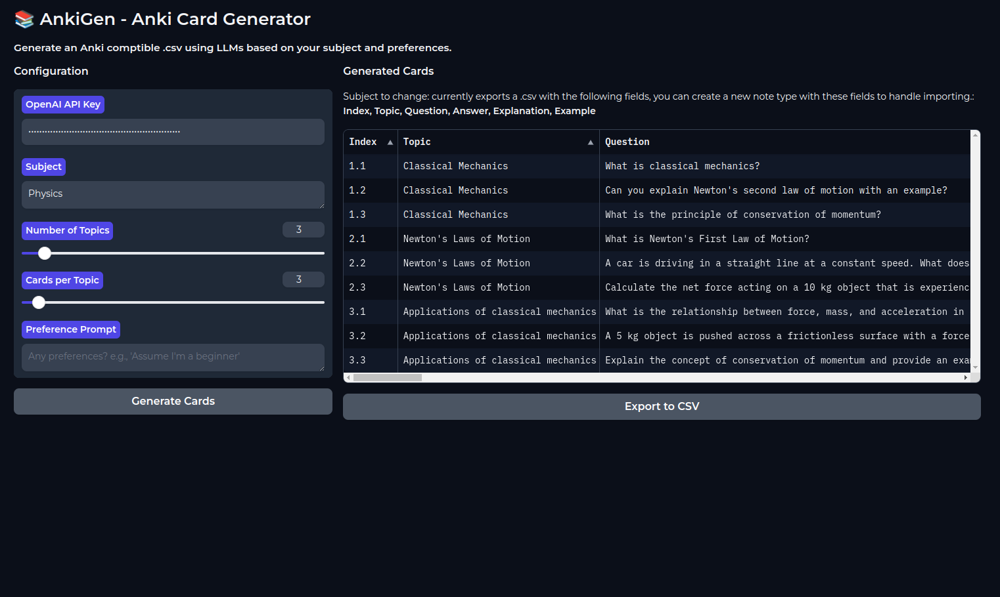

# AnkiGen - Anki Card Generator

AnkiGen is a Gradio-based web application that generates Anki-compatible CSV files using Large Language Models (LLMs) based on user-specified subjects and preferences.

## Features

- Generate Anki cards for various subjects
- Customizable number of topics and cards per topic
- User-friendly interface powered by Gradio
- Exports to CSV format compatible with Anki import
- Utilizes LLMs for high-quality content generation

## FORK features
- instead of Openai, Openrouter is added as an free alternative :)


## Screenshot




## Installation for Local Use

1. Clone this repository:

```
git clone https://github.com/Banishedone/ankigen.git
cd ankigen
```


2. Install the required dependencies:

```
pip install -r requirements.txt
```

3. Set up your Openrouter API key (required for LLM functionality).

## Usage

1. Run the application:

```
gradio app.py --demo-name ankigen
```

2. Open your web browser and navigate to the provided local URL (typically `http://127.0.0.1:7860`).

3. In the application interface:
- Enter your OpenAI API key
- Specify the subject you want to create cards for
- Adjust the number of topics and cards per topic
- (Optional) Add any preference prompts
- Click "Generate Cards"

4. Review the generated cards in the interface.

5. Click "Export to CSV" to download the Anki-compatible file.

## CSV Format

The generated CSV file includes the following fields:
- Index
- Topic
- Question
- Answer
- Explanation
- Example

You can create a new note type in Anki with these fields to handle importing.

## Development

This project is built with:
- Python 3.12
- Gradio 4.44.0

To contribute or modify:
1. Make your changes in `app.py`
2. Update `requirements.txt` if you add new dependencies
3. Test thoroughly before submitting pull requests

## License

BSD 2.0

## Acknowledgments

- This project uses the Gradio library (https://gradio.app/) for the web interface
- Card generation is powered by OpenAI's language models